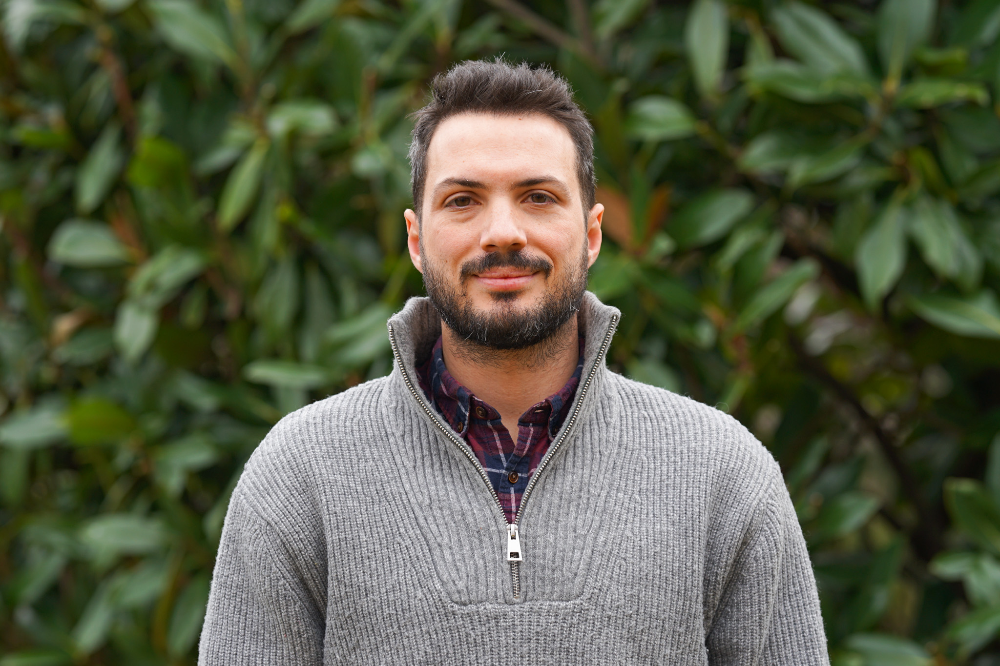

::: {.profile-section}

::: {.profile-left}

::: {.social-links}
<a href="mailto:glemoli@fus.edu" title="Email" class="social-icon"><i class="fa-solid fa-envelope"></i></a>
<a href="https://twitter.com/giacomolem" title="Twitter / X" class="social-icon" target="_blank"><i class="fa-brands fa-twitter"></i></a>
<a href="https://bsky.app/profile/giacomolem.bsky.social" title="Bluesky" class="social-icon" target="_blank"><i class="fa-brands fa-bluesky"></i></a>
<a href="https://scholar.google.it/citations?user=fTgXdvcAAAAJ&hl=it" title="Google Scholar" class="social-icon" target="_blank"><i class="fa-solid fa-graduation-cap"></i></a>
<a href="https://github.com/giacomolemoli" title="GitHub" class="social-icon" target="_blank"><i class="fa-brands fa-github"></i></a>
<a href="https://orcid.org/0000-0002-2748-7862" title="ORCID" class="social-icon" target="_blank"><i class="fa-brands fa-orcid"></i></a>
:::

<a href="assets/cv_lemoli.pdf" class="btn btn-outline-primary cv-btn" target="_blank"><i class="fa-solid fa-download"></i> Download CV</a>

:::

::: {.profile-right}

I am a Postdoctoral Researcher at [Franklin Switzerland](https://www.fus.edu/){target="_blank"}, where I work on the SNSF-funded project [DIVIDE](https://data.snf.ch/grants/grant/10003605){target="_blank"}, led by [Oliver Strijbis](https://oliverstrijbis.com/){target="_blank"}. Before that, I was a Research Fellow at the [Institute for Advanced Study in Toulouse](https://www.iast.fr/){target="_blank"}. I hold a PhD in Politics from [New York University](https://as.nyu.edu/politics.html){target="_blank"} and an MSc in Economic and Social Sciences from [Bocconi University](https://www.unibocconi.eu/){target="_blank"}.

In January 2027 I will join the Department of Quantitative Methods at [CUNEF Universidad](https://www.cunef.edu/){target="_blank"} as an Assistant Professor.

I study the social roots (institutions, identities, networks) of political participation and conflict. My current work focuses on the politics of ethnic and linguistic boundaries in modern states and on social influence during and after violence.

I am interested in combining econometrics, data science, and experiments to test theories and enhance measurement.

My research is published or forthcoming at the *American Journal of Political Science* and *Comparative Political Studies* and has been funded by [UNU-WIDER](https://www.wider.unu.edu/){target="_blank"}, the [Institute for Humane Studies](https://theihs.org/){target="_blank"}, and other institutions.

:::

:::
